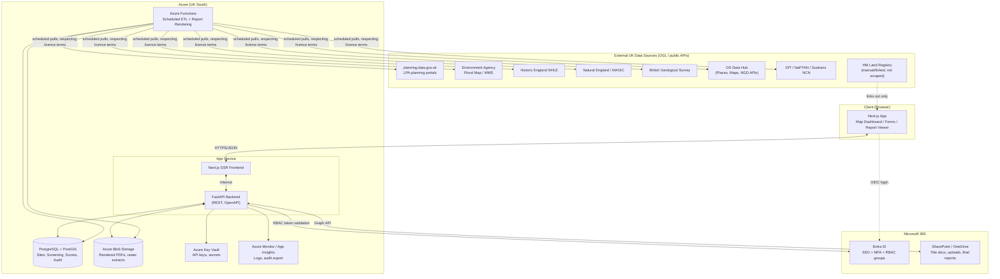
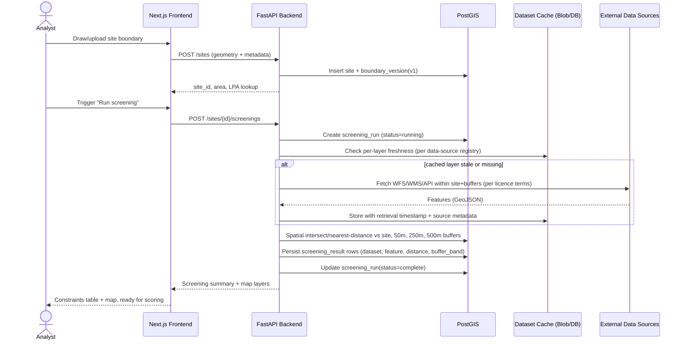

# 2. System Architecture

## 2.1 Technology choices

| Layer | Choice | Rationale |
|---|---|---|
| Frontend | Next.js (React, TypeScript) | SSR for report/dashboard pages, strong ecosystem, easy Azure Static Web Apps / App Service hosting |
| Mapping | MapLibre GL JS (+ Turf.js for client-side geometry ops) | Open-source, vector-tile performant, no per-seat licence, works with OS Maps API/EA WMS tiles |
| Backend | Python FastAPI | Async, OpenAPI-native (matches `04-api-endpoints.md` directly), strong GIS ecosystem (GeoPandas, Shapely, GDAL/OGR bindings) |
| GIS processing | PostGIS, GeoPandas, GDAL/OGR, Shapely | Industry-standard spatial stack; PostGIS does the buffer/intersect screening server-side |
| Database | PostgreSQL 15 + PostGIS 3.4 | Native spatial types/indexes, JSONB for flexible manual-field storage, mature Azure managed offering |
| File storage | SharePoint/OneDrive (via Microsoft Graph) for user-facing documents (title docs, reports); Azure Blob Storage for large raster/GIS extracts and generated PDFs | Keeps end-user documents inside BASECORE's existing 365 governance/retention/DLP policies |
| Auth | Microsoft Entra ID (OIDC/SAML SSO) | Matches existing 365 estate, gives MFA/conditional access for free |
| Reporting | docxtpl + python-docx → LibreOffice headless (`soffice --convert-to pdf`) or Azure Function running Gotenberg for DOCX→PDF | Keeps the DOCX as the editable master; PDF is a rendered export, not a second source of truth |
| Background jobs | Azure Functions / a Celery+Redis worker | Scheduled dataset refresh, screening re-runs, report rendering (all can be slow/blocking) |
| Hosting | Azure App Service (frontend + backend containers), Azure Database for PostgreSQL Flexible Server, Azure Blob Storage, Azure Key Vault, Azure Monitor/App Insights | UK South region; PaaS reduces ops burden for a small team |
| CI/CD | GitHub Actions → Azure | Matches this repository |

## 2.2 High-level architecture

## 2.3 Data flow: creating a site and running a screen

## 2.4 Environments

- **dev** — shared development/test data only, synthetic sites.
- **staging** — mirrors production config, used for UAT against the 3–5 test sites in
  `15-testing-and-acceptance-checklist.md`.
- **production** — BASECORE internal use, Entra ID production tenant, UK South region,
  daily automated backups (35-day retention on PostgreSQL Flexible Server).

## 2.5 Security architecture summary

- All traffic TLS 1.2+; HSTS enabled.
- Entra ID SSO, groups mapped to the roles in `01-executive-specification.md` §1.3.
- API enforces RBAC per-endpoint and per-site confidentiality classification (see schema).
- Secrets (data-provider API keys, storage connection strings) in Key Vault, never in code
  or environment files committed to source control.
- Audit log table is append-only (no UPDATE/DELETE grants for the application role; a
  separate, tightly restricted admin role may perform GDPR erasure requests with a logged
  justification).
- Regular dependency and container image scanning in CI.
- Full checklist in `16-assumptions-licensing-and-professional-advice.md`.
